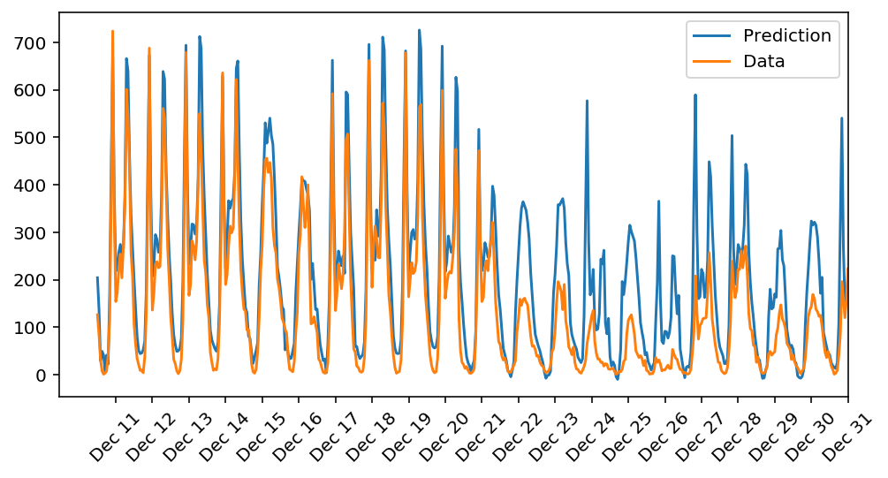

# Project overview

Project was done as coursework for Udacity "Deep Learning" Nanodegree.

In this project I've built my first neural network and used it to predict daily bike rental ridership.

# Further details

The Neural Network had been built from scratch using [NumPy](https://numpy.org/) library.

## Network Architecture

Neural Network consist of three fully connected layers:

* input layer
* hidden layer
* output layer

# Results

As part of work I gained new skills like:

* Insights how fully connected layer works
* Forward pass and backward error propagation implementation
* Hyper parameters and learning parameter tuning
* Testing neural network
* Estimating nn learning capacity based on train/test loss diference

# Conclusion

Neural network has managed to achieve good results. However, model overestimates bike ridership during Christmas holiday because this information hadn't been taken into account.

